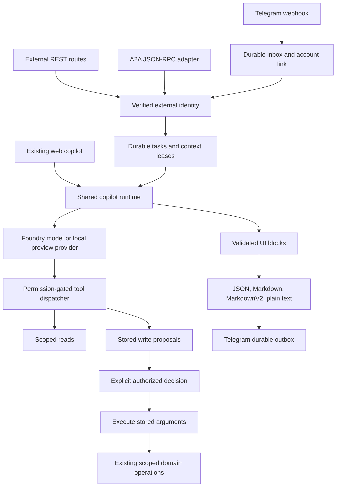
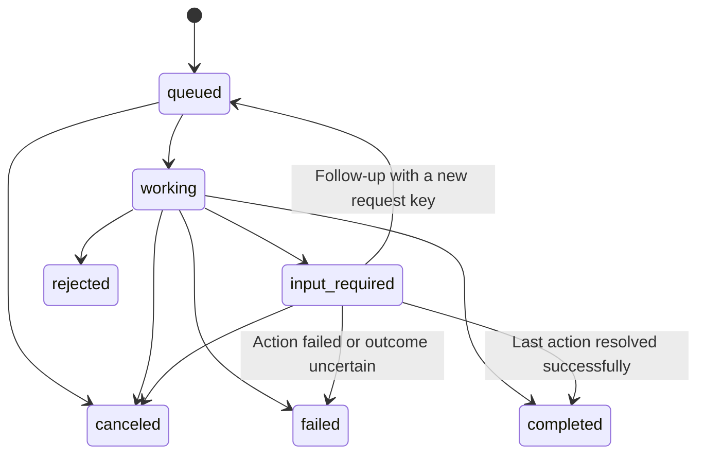

# Copilot Integration Guide

This guide is the implementation handoff for applications and AI coding agents that call or extend the OOVIE BD copilot. It describes the external REST API, A2A interface, Telegram adapter, shared execution policy, durable storage, deployment, and verification procedures.

The external REST contract is version `1`. The A2A interface advertises protocol `1.0` and uses `@a2a-js/sdk` `1.2.0`, checked against the A2A `1.0.1` specification. The SDK package version is not the protocol version. Read the installed lockfile before changing either.

Integration features are disabled by default. Adding this code does not register a Telegram bot, create an Entra application registration, distribute credentials, or activate the deployed service.

## Contents

1. [Choose an interface](#choose-an-interface)
2. [Architecture and source ownership](#architecture-and-source-ownership)
3. [Security rules](#security-rules)
4. [Local quick start](#local-quick-start)
5. [Client identities and permissions](#client-identities-and-permissions)
6. [Microsoft Entra configuration](#microsoft-entra-configuration)
7. [REST contract](#rest-contract)
8. [Task lifecycle and conversation continuity](#task-lifecycle-and-conversation-continuity)
9. [Action confirmation](#action-confirmation)
10. [Output rendering and artifacts](#output-rendering-and-artifacts)
11. [A2A interoperability](#a2a-interoperability)
12. [Telegram setup and use](#telegram-setup-and-use)
13. [Durability and recovery](#durability-and-recovery)
14. [Azure deployment](#azure-deployment)
15. [Operations and troubleshooting](#operations-and-troubleshooting)
16. [Testing and release gates](#testing-and-release-gates)
17. [Extension playbook for future agents](#extension-playbook-for-future-agents)
18. [Limits and unsupported features](#limits-and-unsupported-features)
19. [Protocol and platform sources](#protocol-and-platform-sources)

## Choose an interface

| Consumer | Interface | Authentication | Output |
| --- | --- | --- | --- |
| Another application's backend | `/api/copilot/v1/*` | Registered bearer client or verified Entra access token | JSON task envelope with structured blocks, rendered messages, actions, and artifacts |
| An A2A-capable agent | `/.well-known/agent-card.json`, then `/api/a2a` | Same client registration, separate A2A ownership partition | A2A tasks, artifacts, status events, and interrupted-task continuation |
| A person in Telegram | Private chat with the configured bot | Telegram webhook secret plus a two-step link to a signed-in application account | MarkdownV2 messages, inline approval buttons, CSV or JSON files |
| The existing web UI | Existing browser copilot routes and server actions | Auth.js session and current application permissions | Existing rich block UI, charts, tables, history, and explicit action controls |

Use REST for a conventional application integration. Use A2A when the caller already implements A2A discovery and task handling. Use JSON output when another program needs exact values. Markdown and plain text are presentation formats, not reliable substitutes for the structured action contract.

The legacy per-tool API and its OpenAPI document are separate interfaces. Do not confuse `/api/copilot/openapi` with the new `/api/copilot/v1/openapi`. The new API accepts a request for the copilot to handle; it does not expose an unrestricted tool-execution endpoint.

An external browser application should normally call its own backend, which authenticates to this API. No permissive CORS policy is added here. Never put a service bearer token, bot token, client secret, or model credential into a browser bundle or local storage.

## Architecture and source ownership



### The actual model path

The application calls the configured Foundry-hosted model through its own tool loop. The canonical runtime prompt and orchestration live in [../src/lib/copilot/provider.ts](../src/lib/copilot/provider.ts). The tool registry and dispatcher live in the application.

[../scripts/create-agent.sh](../scripts/create-agent.sh) publishes a separate named prompt agent in the Foundry portal. The running application does not invoke that named agent. Editing it in the portal does not change application chat. This integration reuses the application runtime; it does not migrate orchestration to Foundry Agent Service or attach the application tools to the portal agent.

With `COPILOT_CHAT_ENDPOINT` absent, the provider is a deterministic local preview. That mode is useful for repeatable tests, but passing local tests does not prove that live model routing or a new model deployment works.

### Source map

| File | Responsibility |
| --- | --- |
| [../src/lib/copilot/execution.ts](../src/lib/copilot/execution.ts) | Request-local execution policy: deny, propose, or execute writes; cancellation and tool allowlist |
| [../src/lib/copilot/runtime.ts](../src/lib/copilot/runtime.ts) | Shared proposal-only turn runner, argument validation, canonical action keys |
| [../src/lib/copilot/dispatch.ts](../src/lib/copilot/dispatch.ts) | Tool lookup, effective permissions, write gate, policy enforcement |
| [../src/lib/copilot/external/contracts.ts](../src/lib/copilot/external/contracts.ts) | External input schema, public types, task and action states |
| [../src/lib/copilot/external/auth.ts](../src/lib/copilot/external/auth.ts) | Opaque and Entra credentials, current user grants, identity ownership |
| [../src/lib/copilot/external/http.ts](../src/lib/copilot/external/http.ts) | Bounded JSON input and safe HTTP errors |
| [../src/lib/copilot/external/store.ts](../src/lib/copilot/external/store.ts) | Cosmos and local durable record stores, conditional writes, TTL |
| [../src/lib/copilot/external/tasks.ts](../src/lib/copilot/external/tasks.ts) | Submission, idempotency, context ordering, execution, approval, cancellation, recovery |
| [../src/lib/copilot/external/worker.ts](../src/lib/copilot/external/worker.ts) | Periodic task processing |
| [../src/lib/copilot/external/render.ts](../src/lib/copilot/external/render.ts) | Presentation conversion and full-data artifacts |
| [../src/lib/copilot/external/a2a.ts](../src/lib/copilot/external/a2a.ts) | Agent Card, official SDK transport, protocol state and artifact conversion |
| [../src/lib/copilot/external/openapi.ts](../src/lib/copilot/external/openapi.ts) | OpenAPI 3.1 contract for REST clients |
| [../src/lib/copilot/external/telegram-link.ts](../src/lib/copilot/external/telegram-link.ts) | Expiring link challenge, candidate confirmation, disconnect |
| [../src/lib/copilot/external/telegram.ts](../src/lib/copilot/external/telegram.ts) | Inbox, private-chat checks, callbacks, conversation sessions, outbox, delivery recovery |
| [../src/app/actions/integrations.ts](../src/app/actions/integrations.ts) | Signed-in account linking actions |
| [../src/components/copilot/TelegramConnection.tsx](../src/components/copilot/TelegramConnection.tsx) | Existing-design account connection UI |
| [../src/instrumentation.ts](../src/instrumentation.ts) | Node worker startup |
| [../infra/resources.bicep](../infra/resources.bicep) | Container, configuration, secrets, and Cosmos declarations |

REST and A2A are independently callable endpoints in the same Next.js Container App. They share its availability, CPU, memory, deployment, and model capacity. Separate URLs do not provide independent scaling or failure isolation. A separate worker service or API deployment is a future deployment change, not an existing capability.

## Security rules

These rules apply to every future adapter:

1. Verify the caller before looking up tasks or invoking tools. External routes do not accept a browser session as a substitute for a bearer token.
2. Resolve users and their profiles from current storage. A missing user, inactive user, missing profile, revoked delegation, or disconnected Telegram identity fails closed.
3. Intersect delegated-user permissions with client permissions. A client cannot add authority to the person it represents.
4. Keep ownership tied to the verified channel, client, user, and subject. Never trust a request-body `userId`, email address, Telegram username, or model claim as identity.
5. Run generated turns in proposal-only or read-only mode. An imperative user sentence is not permission to bypass approval.
6. Execute only stored, validated action arguments after an explicit decision. Do not accept replacement arguments in an approval request.
7. Recheck permissions when executing a write and before delivering stored output. Authentication at submission is insufficient for queued work.
8. Keep record-scope checks in the underlying tools and domain operations. A transport permission does not grant access to every lead.
9. Do not fetch arbitrary file URLs, accept arbitrary callback destinations, or follow client-supplied network locations.
10. Treat Markdown, model text, and retrieved material as untrusted content. Neither text nor an action label is an authorization decision.
11. Keep secrets out of prompts, browser bundles, URLs, logs, test artifacts, screenshots, and example configuration committed to git.
12. Never replay an uncertain external side effect automatically. Inspect the actual record or external system first.

Task partitioning is application-level authorization within a shared Cosmos container. It does not give each client a separate Azure security boundary. Operators with database access can read the container and must be trusted accordingly.

## Local quick start

Use a development data store and a fresh local-only client. Do not copy production credentials into the Playwright environment.

```bash
npm ci
node scripts/copilot-client.mjs --id local-reader --name "Local reader" --output /tmp/oovie-reader.token > /tmp/oovie-reader-client.json
```

The generator creates a random token in a new file with mode `0600`. It refuses to overwrite an existing file. Standard output contains a configuration object with the SHA-256 digest, not the token. The example client is read-only but can read all leads; review that grant before using the configuration outside a local fixture environment.

In the terminal that will run the development server:

```bash
export COPILOT_CLIENTS_JSON="$(node --input-type=module -e 'import { readFileSync } from "node:fs"; process.stdout.write(JSON.stringify([JSON.parse(readFileSync("/tmp/oovie-reader-client.json", "utf8"))]));')"
export COPILOT_EXTERNAL_ENABLED=true
export TELEGRAM_ENABLED=false
export APP_URL=http://localhost:3000
export COSMOS_ENDPOINT=
export COPILOT_CHAT_ENDPOINT=
npm run dev
```

These empty Cosmos/model variables deliberately select local storage and the deterministic provider. Use them only in a development terminal. Local user authentication still follows the repository's normal development setup.

In another terminal, run the verifier without printing the token:

```bash
COPILOT_INTEGRATION_TOKEN="$(< /tmp/oovie-reader.token)" APP_URL=http://localhost:3000 node scripts/verify-copilot-integration.mjs
```

The verifier checks capabilities, OpenAPI, REST submission, task SSE, task retrieval, public discovery, and A2A submission. It reports status and artifact counts, not CRM contents or credentials. It never approves an action. It creates task/history/audit records and can consume model capacity when pointed at a model-enabled server, so "read-only" means no requested CRM mutation, not zero database writes or zero cost.

The verifier permits HTTPS origins and loopback HTTP only. It refuses redirects and does not send authentication to discovery. Use a deliberately read-only client even though the probe asks for no changes.

For the complete Telegram fixture, prefer the existing Playwright setup:

```bash
npx playwright test e2e/integrations.spec.ts --reporter=line
```

That setup starts its own development server, seeds test identities, and uses a local Bot API emulator. Do not run it against production.

## Client identities and permissions

### Configuration schema

`COPILOT_CLIENTS_JSON` is a JSON array of at most 100 clients. In Azure it is read from a Key Vault-backed Container Apps secret. Unknown client fields or permission keys cause configuration validation to fail.

| Field | Meaning and default |
| --- | --- |
| `id` | Unique stable client identifier, 1-64 ASCII letters, digits, `_`, or `-` |
| `name` | Audit/display name, 1-100 characters |
| `enabled` | Defaults to `true`; `false` revokes the registration |
| `tokenSha256` | Optional lowercase 64-character SHA-256 digest of the complete opaque token |
| `entraAppId` | Optional UUID of the calling Entra application's client ID; unique across registrations |
| `expiresAt` | Optional ISO timestamp; registration rejected at or after expiry |
| `scopes` | Defaults to `["copilot:read"]` |
| `permissions` | Defaults to `{ "copilot:use": "all" }`; no CRM permission is implicit |
| `allowedTools` | Optional additional allowlist; an empty list permits no tools |
| `delegatedUsers` | Map of verified Entra `oid` values to local application user IDs; defaults to `{}` |
| `requestsPerMinute` | Integer 1-300; default 30 |

Register a production Entra service client without an opaque-token digest:

```json
[
  {
    "id": "reporting-service",
    "name": "Reporting service",
    "enabled": true,
    "entraAppId": "22222222-2222-4222-8222-222222222222",
    "scopes": ["copilot:read"],
    "permissions": {
      "copilot:use": "all",
      "lead:read": "all",
      "scoring:read": "all"
    },
    "allowedTools": ["search_leads", "get_lead", "explain_score", "pipeline_summary"],
    "requestsPerMinute": 30
  }
]
```

Replace the example UUID with the actual calling application's client ID. The API's own application ID is a different value and is used as the audience.

The schema supports both authentication methods on one registration, but production deployments with a no-shared-key policy should omit `tokenSha256` entirely. Telegram has a native bot credential and webhook secret; enabling it requires explicit approval under the applicable third-party data and credential policy.

### Opaque token rules

The wire format is `copilot.ext.<client-id>.<random-secret>`. The server hashes the full token and compares equal-length digests in constant time. Store only the digest in client configuration. Store the token in the calling application's secret manager.

Use [../scripts/copilot-client.mjs](../scripts/copilot-client.mjs) instead of inventing tokens. Client IDs are not secrets. The digest is insufficient to authenticate by itself. The old `COPILOT_API_KEY`, model credentials, Telegram bot token, and Auth.js cookie are not accepted as external API credentials.

To rotate an opaque credential, generate a new token securely and replace the configured digest. Only one digest is accepted per registration; there is no automatic two-key overlap. Use a second client registration for a planned overlap if necessary, remembering that a new client ID gets different task ownership.

Removing or disabling a registration, changing its expiry, or removing delegation takes effect when the new server configuration is active on the serving replicas. Environment variables do not hot-reload from a changed file or secret in every running process.

### Three integration scopes

| Scope | Allows | Still required |
| --- | --- | --- |
| `copilot:read` | Submit/read tasks and use permitted read tools | `copilot:use`, each tool's permission, record scope, optional allowlist |
| `copilot:propose` | Produce stored write proposals | `copilot:read`, `copilot:tool:write`, underlying tool permission |
| `copilot:approve` | Explicitly approve or reject stored actions | Current registration/user grants, `copilot:tool:write`, underlying tool permission, valid pending action |

To approve a stage change, for example, a client needs all three integration scopes, `copilot:use`, `copilot:tool:write`, the stage-change permission, and access to the target lead. A token with an Entra `Copilot.Invoke` role alone does not grant those domain permissions.

The permission vocabulary is authoritative in [../src/lib/auth/catalogue.ts](../src/lib/auth/catalogue.ts). Reuse it. Do not create parallel permission names in a channel adapter.

### Service and delegated principals

A service principal has local actor ID `integration:<client-id>`. It is never a superuser and has no implicit human ownership or team membership. An `own` grant will not make it the owner of existing human-owned leads.

A delegated principal uses the mapped application's user record and current profile assignments, then intersects every permission with the configured client ceiling. Delegation cannot preserve a user's superuser bypass. Missing mappings are rejected; email, display name, and request-body fields are never mapping keys.

Telegram uses the linked user's current application permissions. The link grants no new application permissions. It also requires the stored link and the user's current connection settings to agree.

### Ownership and permission changes

The owner partition is a hash of `[channel, clientId, userId-or-null, subject-or-null]`. Consequently:

- Client A cannot read client B's task by guessing its ID.
- REST and A2A tasks are separate even with the same bearer credential.
- Two delegated users of one client cannot read each other's tasks.
- Telegram history is separate from the user's web history and other channels.
- A new bot ID creates a different Telegram identity partition.

Tasks and contexts also store a fingerprint of effective permissions, integration scopes, and the tool allowlist. If those grants change, the API rejects the old context/task with `grants_changed`. Start a new conversation rather than copying old history into the new authority context. Equivalent configuration reordering may also invalidate a fingerprint; treat that as a safe restart, not permission recovery.

This fingerprint does not version every CRM record's ownership. Stored answers are authorized snapshots. A record reassignment after an answer was generated does not retract data already delivered or independently copied by the receiving application. Use short retention and an approved data-handling policy; a deployment needing per-record read-time revocation of historical answers needs additional provenance filtering.

## Microsoft Entra configuration

The current implementation accepts one configured tenant in the Microsoft public cloud and v2 access tokens signed with RS256. It pins the issuer and Microsoft JWKS endpoint from the configured tenant UUID. It does not accept a caller-provided issuer or JWKS URL.

### Resource API registration

1. Register an API application in the intended Entra tenant.
2. Set its API manifest `requestedAccessTokenVersion` to `2`. Calling a `/v2.0/token` URL alone does not force a v2 access token for a resource configured for v1 tokens.
3. Expose an application role with value `Copilot.Invoke` for application callers. Use another value only if `COPILOT_ENTRA_ROLE` is set to that exact value.
4. For user delegation, expose a delegated scope with the same configured value. The server currently has one role/scope-name setting, not separate names for the two flows.
5. Record the API audience and tenant UUID. V2 access tokens commonly use the API's application/client UUID as `aud`; the acquisition scope can still be `api://<api-client-id>/.default`. Configure the server with the exact intended `aud`, not the scope string and not a Graph audience.
6. Configure tenant consent and application assignment requirements according to organizational policy.

### Calling application registration

1. Register the calling backend or workload.
2. Assign the API's `Copilot.Invoke` application permission and obtain administrator consent for service calls.
3. Prefer a managed workload identity, certificate, or federated credential over a shared client secret.
4. Add this calling application's client ID as `entraAppId` in `COPILOT_CLIENTS_JSON`.
5. Set the client scopes, domain permission ceiling, and tool allowlist. Entra registration does not replace this allowlist.
6. Acquire an access token for this API through an appropriate Microsoft authentication library. Service callers request the API resource's `/.default` scope.
7. Send the access token in `Authorization: Bearer ...`. Do not send an ID token, Graph token, Azure management token, or browser session cookie.

Runtime settings:

```text
COPILOT_ENTRA_TENANT_ID=<tenant UUID>
COPILOT_ENTRA_AUDIENCE=<the API's exact access-token audience>
COPILOT_ENTRA_ROLE=Copilot.Invoke
```

The server validates signature, issuer, audience, expiry, required `iat` and `tid`, the exact tenant, and the calling `azp`. For application tokens it requires the configured value in `roles`. For delegated tokens it requires the value in the space-separated `scp` claim, a string `oid`, and an explicit mapping for that `oid`.

Example delegated mapping within a client:

```json
{
  "delegatedUsers": {
    "33333333-3333-4333-8333-333333333333": "local-application-user-id"
  }
}
```

Only administrators should edit this mapping. A user cannot claim another local ID through the API. Revoking the map or deactivating the local user blocks subsequent execution and access even if the caller still has a correctly signed token.

Access tokens authenticate incoming requests. Once accepted, a durable task keeps the verified identity reference, not a stored bearer token. Workers recheck the client registration and user authority; they do not keep or refresh the original access token. A task may therefore finish after that original token expires. Registration revocation is the application control for queued work.

Locally generated RSA/JWKS tests verify the cryptographic and claims-validation path. They do not prove tenant consent, live Microsoft signing-key retrieval, Conditional Access behavior, or an actual workload identity deployment. Validate those in staging with a real tenant token before release.

## REST contract

### Common behavior

All routes below require `Authorization: Bearer <access-token>`. JSON requests require `Content-Type: application/json`. Bodies are limited to 32 KiB even when the caller omits `Content-Length` or streams the request.

Responses use `Cache-Control: no-store`. Artifacts are authenticated attachments, not public or signed download URLs. A successful response should not be placed in a shared proxy cache.

REST always returns a JSON task envelope. Setting `format: "markdown"` changes `result.messages`, not the HTTP content type of the task route.

| Method | Route | Purpose |
| --- | --- | --- |
| `POST` | `/api/copilot/v1/messages` | Submit a new task or continue an interrupted one |
| `GET` | `/api/copilot/v1/tasks?offset=0` | List the current owner's recent accessible tasks |
| `GET` | `/api/copilot/v1/tasks/{id}` | Retrieve a task snapshot |
| `GET` | `/api/copilot/v1/tasks/{id}/events` | Observe task snapshots over SSE |
| `POST` | `/api/copilot/v1/tasks/{id}/cancel` | Cancel queued/running/interrupted work where possible |
| `POST` | `/api/copilot/v1/tasks/{id}/actions/{actionId}` | Approve or reject one stored action |
| `GET` | `/api/copilot/v1/tasks/{id}/artifacts/{artifactId}` | Download the exact stored artifact |
| `GET` | `/api/copilot/v1/capabilities` | Inspect caller scopes, permitted tool declarations, formats, and limits |
| `GET` | `/api/copilot/v1/openapi` | Retrieve the authenticated OpenAPI 3.1 contract |

The capability tool list reflects domain grants and an optional allowlist. A listed write tool still needs proposal/approval scopes and the write gate; listing is not permission to execute it directly.

### Submit a message

```http
POST /api/copilot/v1/messages HTTP/1.1
Authorization: Bearer <access-token>
Content-Type: application/json
Idempotency-Key: reporting-2026-09-22-001

{
  "message": "Summarise the pipeline",
  "format": "json",
  "reasoning": false
}
```

| Input | Rules |
| --- | --- |
| `message` | Required string, trimmed, 1-8,000 characters |
| `format` | `json`, `markdown`, `telegram-markdownv2`, or `plain-text`; defaults to `json` |
| `reasoning` | Optional boolean, defaults to `false`; may affect model effort, never exports raw reasoning blocks |
| `contextId` | Optional UUID returned by this owner/channel's earlier task |
| `taskId` | Optional existing interrupted task ID, 1-100 characters |

Unknown input fields are rejected. Do not send `userId`, model credentials, arbitrary tool arguments, conversation history, or an approval flag in this body.

`Idempotency-Key` is required. It must be 1-128 characters from ASCII letters, digits, `.`, `_`, `:`, and `-`. Generate a new value for a new logical request and retain it until the outcome is known.

The server returns `202 Accepted`, a `Location` pointing to the task route, and `Retry-After: 1`. Acceptance means the record was persisted for processing; it does not mean a model call or write succeeded.

Illustrative queued response:

```json
{
  "apiVersion": "1",
  "id": "tsk-aaaaaaaaaaaaaaaaaaaaaaaaaaaaaaaaaaaaaaaa",
  "contextId": "44444444-4444-4444-8444-444444444444",
  "state": "queued",
  "createdAt": "2026-09-22T12:00:00.000Z",
  "updatedAt": "2026-09-22T12:00:00.000Z",
  "actions": [],
  "tools": []
}
```

When available, `result` contains:

```json
{
  "format": "json",
  "messages": [{ "text": "Example answer" }],
  "blocks": [{ "type": "text", "text": "Example answer" }],
  "artifacts": [],
  "warnings": []
}
```

`tools` contains operation names and success flags, not full tool responses. `error` contains a stable code and safe message when execution fails. Internal storage fields, identity configuration, credential material, and lease records are not part of the public task view.

### Minimal backend client

This example uses an existing server-side `token`; acquire or load it through the calling application's secret/token provider. It does not request changes or approve actions.

```javascript
const origin = new URL(process.env.APP_URL).origin;
const token = process.env.COPILOT_INTEGRATION_TOKEN;
const idempotencyKey = crypto.randomUUID();

const created = await fetch(`${origin}/api/copilot/v1/messages`, {
  method: "POST",
  headers: {
    authorization: `Bearer ${token}`,
    "content-type": "application/json",
    "idempotency-key": idempotencyKey,
  },
  body: JSON.stringify({ message: "Summarise the pipeline", format: "json" }),
  redirect: "error",
});
if (created.status !== 202) throw new Error(`Submission failed: ${created.status}`);
const submitted = await created.json();

const events = await fetch(`${origin}/api/copilot/v1/tasks/${encodeURIComponent(submitted.id)}/events`, {
  headers: { authorization: `Bearer ${token}` },
  redirect: "error",
  signal: AbortSignal.timeout(180000),
});
if (!events.ok) throw new Error(`Observation failed: ${events.status}`);
await events.text();

const response = await fetch(`${origin}/api/copilot/v1/tasks/${encodeURIComponent(submitted.id)}`, {
  headers: { authorization: `Bearer ${token}` },
  redirect: "error",
});
if (!response.ok) throw new Error(`Task retrieval failed: ${response.status}`);
const task = await response.json();
if (task.state === "input-required") {
  // Present the question or stored actions to the authorized user.
} else if (task.state !== "completed") {
  throw new Error(`Task ended or paused in state ${task.state}`);
}
```

For incremental UI updates, parse the SSE stream with an established SSE parser instead of buffering it as this compact example does. Add an application deadline, reconnect policy, cancellation control, and safe error presentation before using it as a production client.

### Polling and SSE

The events route sends `event: task` with the complete public task JSON whenever the stored task version changes. A stream can also contain `event: error`. These are task snapshots, not model-token deltas or the browser copilot's `block` events.

Observation normally ends when the task reaches a terminal or interrupted state, or after about 150 seconds. The worker's individual turn deadline is 120 seconds, but queueing can outlast one observation connection.

Disconnecting an SSE client does not cancel the task. Reconnect by the same task ID to receive the current state. There is no ordered event log, `Last-Event-ID` replay contract, or heartbeat guarantee. Fetch the current task after a stream error before deciding whether to reconnect or cancel.

Native browser `EventSource` cannot set an arbitrary Authorization header. Use authenticated fetch streaming through the application's backend or a library with explicit header support. Never work around this by putting a bearer token in the query string.

Polling requests count against the configured request quota. At the default 30/minute, one poll every second is too frequent. Prefer SSE, or use bounded polling with backoff and respect `Retry-After`.

### Listing and artifacts

REST listing returns up to 50 tasks per page from at most the newest 1,000 stored tasks for the owner. Follow `nextOffset` when present. Offset pagination is not a stable export cursor while new tasks arrive; deduplicate by task ID. Tasks with a changed grant fingerprint are excluded.

Artifacts are already available inline in the JSON result as `{ id, name, mediaType, text }`. The artifact route returns the same content with an attachment disposition. Use the supplied media type and a safe download name. Do not evaluate an artifact as code or render raw JSON strings as HTML.

REST artifact routes cannot retrieve A2A-owned tasks. Request `application/json` from A2A and consume the nested artifact data there.

### HTTP errors

```json
{
  "error": {
    "code": "idempotency_conflict",
    "message": "This key was already used for a different request."
  },
  "requestId": "55555555-5555-4555-8555-555555555555"
}
```

| HTTP status | Representative codes | Client response |
| --- | --- | --- |
| 400 | `invalid_request`, `invalid_json`, `idempotency_key_required`, `context_mismatch` | Correct the request; validation may include field paths |
| 401 | `unauthorized` | Acquire the correct credential or check registration; do not retry indefinitely |
| 403 | `forbidden`, `insufficient_scope`, `grants_changed`, `account_unavailable`, `delegation_revoked` | Stop and resolve authority; create a fresh conversation after legitimate grant changes |
| 404 | `task_not_found`, `context_not_found`, `action_not_found` | Check owner/channel, retention, and ID; no existence information for another owner's task |
| 409 | `idempotency_conflict`, `task_busy`, `context_busy`, `task_not_resumable`, `task_not_cancelable`, `action_in_progress`, `action_already_decided` | Read current state; only a busy conflict may justify a bounded retry |
| 410 | `action_expired` | Ask for a new proposal; never revive the old approval |
| 413 | `payload_too_large` | Shorten the request |
| 415 | `unsupported_media_type` | Send JSON |
| 429 | `rate_limited`, `queue_full` | Back off; current HTTP errors include `Retry-After: 60` |
| 500 | `internal_error` | Retain request/task IDs; inspect safe server logs and current task state |
| 503 | `integration_disabled`, `configuration_error`, `telegram_unavailable` | Fix configuration or wait for an authorized rollout |

Execution can fail asynchronously after a `202`. Inspect `task.error`, not only HTTP status. Examples include `result_too_large`, `too_many_actions`, `context_expired`, `retry_exhausted`, `deadline_exceeded`, and `execution_failed`.

## Task lifecycle and conversation continuity



The wire state is `input-required`; the diagram uses an identifier without a hyphen. `auth-required` is reserved in the contract and mapped to A2A, but the current runtime does not implement an interactive external OAuth challenge flow. Authentication failures are normally rejected at the boundary or reject queued work.

`completed`, `failed`, `canceled`, and `rejected` are terminal. `input-required` can mean clarification or stored action approval. Inspect `actions`: a pending action is different from a natural-language clarification question.

### Continuing a conversation

For another independent turn after a completed task, submit a new message with its `contextId`, a new idempotency key, and no `taskId`.

To resume an interrupted task, include its `taskId`; its `contextId` is optional, but must match if supplied. Use a new idempotency key for the follow-up. The server retains the prior context, clears the old result/actions for the resumed turn, and queues new generation.

```json
{
  "message": "Use the fixture lead owned by my account",
  "taskId": "tsk-aaaaaaaaaaaaaaaaaaaaaaaaaaaaaaaaaaaaaaaa",
  "contextId": "44444444-4444-4444-8444-444444444444",
  "format": "json"
}
```

A completed task cannot be resumed with a new turn. A task permits at most 50 distinct request keys. Continue in a new task/context when the limit is reached.

Several queued tasks in one context are processed in creation order with an ID tie-break. Context leases also serialize action decisions with generation. A `context_busy` response means another operation holds that conversation lease.

The external context retains at most 12 recent turns and drops older ones when stored turn data exceeds 750,000 bytes. Model history has its own formatting/budget rules in [../src/lib/copilot/history.ts](../src/lib/copilot/history.ts). Do not assume a permanent transcript or unlimited memory.

### Idempotency

For a new task, the owner and idempotency key determine the task ID. Repeating the same key with the same normalized input returns the existing task. Reusing it with different input returns `409`. The requested format and reasoning flag are part of the input; changing them changes the request.

For continuation, the task stores the request-key hashes it has accepted. Replaying an accepted continuation returns current task state without rerunning the previous turn.

Idempotency lasts only while the task record is retained. The default is seven days since the record's last update, not an unlimited financial or message-delivery deduplication ledger. A client requiring longer deduplication must retain its own logical request IDs and outcomes.

After a network timeout, repeat the same request with the same key or retrieve the known task. Do not generate a new key automatically: that asks for new work.

### Cancellation

Send `POST /api/copilot/v1/tasks/{id}/cancel`. Repeating cancellation of an already-canceled task returns its current state. Canceling another terminal task returns a conflict.

The worker propagates cancellation to the provider and stops before subsequent tool calls. A monitor notices cross-replica cancellation through storage. Some upstream requests may already have been accepted and may still incur cost. Cancellation cannot recall a confirmed write already executing, an email already sent, or a Telegram message already delivered.

Canceling a pending proposal rejects pending actions. Closing a web page, disconnecting a stream, or losing an HTTP response does not imply cancellation.

## Action confirmation

Generated turns never directly execute a write through the shared runner. The dispatcher captures proposed tool calls and the runtime emits a canonical "proposed only" result. The external task engine validates the registry schema, permission, allowlist, scopes, and write flag before storing an action.

Example action:

```json
{
  "id": "66666666-6666-4666-8666-666666666666",
  "tool": "append_note",
  "args": { "leadId": "fixture-lead-id", "body": "Customer requested a follow-up next week." },
  "label": "Add note",
  "expiresAt": "2026-09-22T12:15:00.000Z",
  "state": "pending"
}
```

Build the confirmation UI from authoritative `actions`, not a model-authored button label or prose. Present the operation, target, exact arguments, expiry, and any irreversible effect. A client should require a deliberate user decision before sending an approval. Do not let another model approve every proposal automatically.

```http
POST /api/copilot/v1/tasks/tsk-aaaaaaaaaaaaaaaaaaaaaaaaaaaaaaaaaaaaaaaa/actions/66666666-6666-4666-8666-666666666666 HTTP/1.1
Authorization: Bearer <access-token>
Content-Type: application/json

{ "decision": "approve" }
```

Use `"reject"` to decline. The body is strict: supplying `args`, a different tool, or extra fields is rejected. To change an argument, reject the action and request a new proposal.

The action expires after 15 minutes. At decision time the server reloads identity, checks the task grant fingerprint, locks the context, confirms that the task is awaiting input, revalidates tool arguments and permissions, and conditionally changes the action from `pending` to `executing`. Only one competing decision can claim it.

| Action state | Interpretation |
| --- | --- |
| `pending` | Nothing executed; explicit approval is required |
| `executing` | Approval accepted; do not send a second mutation |
| `succeeded` | Tool returned success; inspect its stored result |
| `failed` | Tool reported a domain failure; inspect result before proposing another attempt |
| `indeterminate` | Execution was interrupted or failed ambiguously; verify actual state before any retry |
| `rejected` | Action declined; no write by this action |

REST returns `409 action_already_decided` on a repeated decision; read the task for the outcome. The A2A adapter treats an identical already-successful approval or identical rejection as retrieval of current state. Telegram duplicate callbacks report the existing state. None of these paths executes a decided action again.

A task can propose at most 12 actions. Multiple actions are independent operations, not a cross-record transaction. Partial success is possible; inspect each action rather than treating the task as an all-or-nothing batch.

An action that references a mutable resource, such as an existing outreach draft, stores that resource ID rather than a frozen copy of every field. The domain tool's own review rules still apply. High-risk consumers should show the referenced recipient/content and verify current state before confirming. A future immutable-content approval design must bind the reviewed version to execution; do not claim that guarantee from an ID-only proposal.

The existing web UI keeps its own explicit action controls. External durable approval IDs belong to this external contract; they are not interchangeable with browser server-action arguments.

## Output rendering and artifacts

### Canonical representation

Validated blocks remain the shared answer representation. External `result.blocks` contains supported blocks with reasoning blocks removed. `result.messages` contains the chosen readable representation. `result.artifacts` preserves table/chart data that does not fit a chat preview. `warnings` names deliberate losses or truncation.

For machine consumption, prefer `json`. It returns plain readable messages plus the structured blocks, actions, and artifacts. Do not scrape a chart's formatted text to recover numeric values when the JSON artifact is available.

### Block conversion matrix

| Block | Chat/text representation | Preserved structured detail |
| --- | --- | --- |
| `heading` | Emphasized title, optional subtitle | Original block |
| `text` | Parsed Markdown prose | Original block |
| `callout` | Optional title and prose | Tone and other fields remain in block |
| `divider` | Spacing | Original block |
| `metrics` | Label/value/unit/change lines | Original metric values and metadata |
| `keyValue` | Label/value lines | Original entries |
| `list` | Bullets or numbered lines | Original items |
| `badges` | Comma-separated labels | Original tone/metadata |
| `table` | First 12 rows as labelled fields | Full block and CSV artifact with `export:csv`, otherwise full JSON artifact |
| `chart` | Series values or scatter coordinates, first 20 entries | Full chart JSON artifact, including points and chart configuration |
| `leadCard`, `leadGrid` | Linked name, stage, priority, score, value, quadrant where present | Original lead fields |
| `companyCard` | Linked company name, industry, owner, deal/value totals | Original card |
| `scoreBreakdown` | Priority/grade/quadrant, opportunity, winnability, expected value, drivers | Original breakdown |
| `comparison` | Titled metric groups | Original comparison |
| `recommendation` | Title, rationale, confidence when present | Original recommendation |
| `timeline` | Dated labels and completion markers | Original events |
| `actions` | Supported navigation links; authoritative stored write actions appended separately | Stored action IDs, arguments, states, expiry, results |
| `sources` | Titles and safe links | Original source metadata; unsafe URLs omitted from rendered links |
| `reasoning` | Omitted | Not exported in external blocks |

Charts are not silently discarded. They become exact data plus a readable preview. There is no PNG/SVG image generation, screenshot renderer, interactive chart, or Telegram Mini App in this implementation.

CSV output quotes cells and prefixes formula-like strings beginning with `=`, `+`, `@`, or `-` after whitespace. Numeric values remain numeric text. This reduces spreadsheet formula injection; a receiving application must still treat downloaded data as untrusted.

The CSV permission governs the CSV presentation. It is not a promise that someone allowed to read a table cannot save or transform the same authorized data. Without CSV permission, the JSON artifact still preserves that data.

### Telegram MarkdownV2

The renderer parses ordinary Markdown with `marked`, converts it to text runs, and applies Telegram-specific escaping. It does not send the model's Markdown directly to Telegram.

Telegram's Bot API allows 4,096 characters after entity parsing for a text message. This adapter uses a conservative limit of 3,500 encoded characters per chunk, keeps formatting balanced in every chunk, and avoids splitting Unicode surrogate pairs. Other output modes use 12,000-character message chunks.

Code spans use code-specific escaping. Links permit HTTP/HTTPS only, reject embedded credentials, and escape link destinations for Telegram. Relative application links are resolved against `APP_URL`. Link previews are disabled on outgoing bot messages.

Unsupported Markdown formatting is flattened into readable text; the renderer does not preserve every visual convention, nested style combination, or code-language annotation. An unusually long link is emitted as readable text. For exact source content use the structured block.

Telegram parse-entity rejection triggers one fallback send without `parse_mode`. The fallback can show literal Markdown escape characters, but does not reinterpret the response as executable HTML. Unknown delivery outcomes are handled separately and are not automatically resent.

Warnings currently include `table_preview_truncated`, `chart_rendered_as_data`, `chart_preview_truncated`, and `unsafe_source_url_omitted`. A consumer should display an attachment/download affordance when a preview is truncated.

## A2A interoperability

### Discovery and transport

Fetch `GET /.well-known/agent-card.json`. This route is public while integrations are enabled and returns 404 while disabled. The card contains capability and endpoint metadata, not CRM records or credentials. It advertises one JSON-RPC interface at `/api/a2a`.

The transport requires `A2A-Version: 1.0`. Missing version is treated as 0.3 by protocol rules and rejected. Old `message/send`, `tasks/get`, and other 0.3 method names are not compatibility aliases. Use the 1.0 methods or the official 1.0-capable SDK.

Authentication is performed by the HTTP route before protocol handling. Bad credentials produce an HTTP authentication error. Supported authenticated calls use JSON-RPC response/error envelopes; a protocol error can arrive with HTTP 200, so always inspect `error` or use the SDK.

| Method | Support |
| --- | --- |
| `SendMessage` | Text input, immediate or blocking response, interrupted-task continuation, action-decision extension |
| `SendStreamingMessage` | Initial task snapshot, then artifact and status updates over SSE |
| `GetTask` | Current caller-owned task |
| `ListTasks` | Owner-scoped tasks, filters, bounded pagination |
| `CancelTask` | Shared cancellation semantics |
| `SubscribeToTask` | Nonterminal task observation; terminal tasks should use `GetTask` |
| Push-notification configuration methods | Explicit protocol error; not advertised |
| Authenticated extended card | Explicit protocol error; not configured |
| gRPC, HTTP+JSON binding | Not implemented or advertised |

The public card advertises input modes `text/plain` and `application/json`. JSON input is restricted to the documented action-decision data part; it is not a general-purpose JSON prompt or arbitrary tool invocation.

### Raw request example

```json
{
  "jsonrpc": "2.0",
  "id": "request-1",
  "method": "SendMessage",
  "params": {
    "message": {
      "messageId": "message-1",
      "role": "ROLE_USER",
      "parts": [{ "text": "Summarise the pipeline", "mediaType": "text/plain" }]
    },
    "configuration": {
      "acceptedOutputModes": ["application/json"],
      "returnImmediately": true
    }
  }
}
```

Send this to `/api/a2a` with the bearer header, JSON content type, and version header. `messageId` is the idempotency identity for text submissions. Keep it stable when retrying a logical message, and use a new one for a follow-up. The JSON-RPC `id` correlates a protocol response and is not the task idempotency key.

`returnImmediately: true` returns the queued/current task. False or omitted waits for a terminal or interrupted state up to the observation window. If observation times out, retrieve/retry the same message ID; do not create a new logical message automatically.

The adapter rejects arbitrary URL/file parts, unsupported part media types, cross-task references, and a send-time tenant-routing parameter. It uses `contextId` for continuity. It does not implement multitenant routing.

### Official JavaScript SDK example

Install the version compatible with this server in the calling application:

```bash
npm install @a2a-js/sdk@1.2.0
```

```javascript
import { AgentCard, SendMessageRequest, GetTaskRequest } from "@a2a-js/sdk";
import { ClientFactory, JsonRpcTransportFactory } from "@a2a-js/sdk/client";

const origin = new URL(process.env.APP_URL).origin;
const token = process.env.COPILOT_INTEGRATION_TOKEN;
const cardResponse = await fetch(`${origin}/.well-known/agent-card.json`, { redirect: "error" });
if (!cardResponse.ok) throw new Error(`Discovery failed: ${cardResponse.status}`);
const card = AgentCard.fromJSON(await cardResponse.json());
if (!card.supportedInterfaces.every((entry) => new URL(entry.url).origin === origin)) {
  throw new Error("Unexpected agent endpoint origin");
}

const authenticatedFetch = (input, init = {}) => {
  const destination = new URL(input instanceof Request ? input.url : input);
  if (destination.origin !== origin) throw new Error("Refusing to forward a credential");
  const headers = new Headers(init.headers);
  headers.set("authorization", `Bearer ${token}`);
  return fetch(input, { ...init, headers, redirect: "error" });
};
const client = await new ClientFactory({
  transports: [new JsonRpcTransportFactory({ fetchImpl: authenticatedFetch })],
}).createFromAgentCard(card);

const answer = await client.sendMessage(SendMessageRequest.fromJSON({
  message: {
    messageId: crypto.randomUUID(),
    role: "ROLE_USER",
    parts: [{ text: "Summarise the pipeline" }],
  },
  configuration: { acceptedOutputModes: ["application/json"] },
}));
if (!("id" in answer)) throw new Error("Expected a task response");
const task = await client.getTask(GetTaskRequest.fromJSON({ id: answer.id }));
for (const artifact of task.artifacts) {
  for (const part of artifact.parts) {
    if (part.content?.$case === "data") {
      const structured = part.content.value;
      // Pass structured blocks/actions to the application's validated renderer.
    }
  }
}
```

The SDK's internal representation uses `content: { $case, value }`. Wire JSON uses fields such as `text` or `data`. Use SDK `fromJSON`/`toJSON` codecs at wire boundaries. Feeding already-internal parts through `fromJSON` can discard their content; the regression tests cover this distinction.

`SendMessage` also wraps its wire payload: a task response is `result.task`, while `GetTask` returns a task as its result. The SDK client unwraps the send response for callers. Raw clients should use `SendMessageResponse.fromJSON` or handle that wrapper explicitly. SDK state enums are numeric internally; the wire names are strings such as `TASK_STATE_COMPLETED`.

Pin the expected discovery origin and supported transport before forwarding a credential. A public Agent Card from an arbitrary URL is not permission to send an OOVIE token to the URL it advertises.

### Output negotiation

When `acceptedOutputModes` is absent, empty, or includes `application/json`, the adapter returns a structured data artifact containing readable text, blocks, stored actions, warnings, and the full nested artifacts.

If JSON is not accepted, it chooses `text/markdown` when available, then `text/plain`. An unsupported-only set is rejected. Text-only negotiation returns text artifacts rather than sneaking an unrequested JSON part into the response. It consequently does not carry the full structured chart/table attachments; request JSON when exact data matters.

`text/csv` is not an independently negotiated A2A answer mode. CSV, when authorized, is a nested artifact inside the structured JSON answer. Telegram MarkdownV2 is a REST/Telegram rendering option, not an advertised A2A media type.

### States and streaming

| Internal state | A2A state |
| --- | --- |
| `queued` | `TASK_STATE_SUBMITTED` |
| `working` | `TASK_STATE_WORKING` |
| `completed` | `TASK_STATE_COMPLETED` |
| `input-required` | `TASK_STATE_INPUT_REQUIRED` |
| `auth-required` | `TASK_STATE_AUTH_REQUIRED` |
| `failed` | `TASK_STATE_FAILED` |
| `canceled` | `TASK_STATE_CANCELED` |
| `rejected` | `TASK_STATE_REJECTED` |

Streaming first yields a task snapshot. Later observations yield artifact updates and status updates. Artifacts are complete replacements (`append: false`, `lastChunk: true`), not token fragments. Disconnecting stops observation, not durable processing.

Task history is not exposed as an A2A transcript; returned `history` is empty. Conversation context is maintained server-side. Clients should retain only the history they are permitted and required to store.

`ListTasks` accepts a page size from 1 through 100, defaults to 50, and uses owner-bound continuation tokens. It operates on the newest 1,000 accessible stored tasks. Continuation tokens are positions, not a durable event cursor or authorization credential.

### Action-decision extension

The Agent Card advertises an optional extension URI ending in `/api/copilot/v1/capabilities#action-decisions`. Approval is a single data part with an existing task ID:

```json
{
  "jsonrpc": "2.0",
  "id": "approval-1",
  "method": "SendMessage",
  "params": {
    "message": {
      "messageId": "approval-message-1",
      "role": "ROLE_USER",
      "taskId": "tsk-aaaaaaaaaaaaaaaaaaaaaaaaaaaaaaaaaaaaaaaa",
      "contextId": "44444444-4444-4444-8444-444444444444",
      "parts": [{
        "data": {
          "type": "copilot.action-decision",
          "actionId": "66666666-6666-4666-8666-666666666666",
          "decision": "approve"
        },
        "mediaType": "application/json"
      }]
    }
  }
}
```

Use the same A2A owner that received the proposal. Mixed text plus decision parts, replacement arguments, absent task IDs, wrong contexts, and expired actions are rejected. The extension does not weaken the normal action permission checks.

A generic client that does not implement the extension can still read and discuss results, but must not claim it confirmed a change merely because it sent "yes" as text. Text continuation may ask the model for another proposal; only the explicit decision path executes a stored one.

A2A provides agent task interoperability. This implementation is not an MCP server. A future MCP wrapper should call these authorized operations or reuse the same runtime policy, rather than bypassing approval by exposing write tools directly.

## Telegram setup and use

### Policy and prerequisites

Obtain a bot from Telegram's BotFather and record its username without `@`. Keep the bot token in Key Vault or an equivalent secret manager. Generate an independent random webhook secret of at least 32 characters, using only letters, digits, `_`, and `-`; the registration script accepts up to 256 characters.

Bot chats are not end-to-end encrypted. Telegram receives the messages and artifacts sent to it. `protect_content: true` reduces ordinary forwarding/saving affordances but is not a confidentiality guarantee and cannot prevent screenshots or external copying. Obtain approval to transmit CRM data through Telegram before enabling it.

Required runtime settings:

```text
COPILOT_EXTERNAL_ENABLED=true
TELEGRAM_ENABLED=true
TELEGRAM_BOT_TOKEN=<secret supplied by the runtime secret manager>
TELEGRAM_WEBHOOK_SECRET=<separate random secret>
TELEGRAM_BOT_USERNAME=<BotFather username without @>
APP_URL=https://<public application origin>
```

The bot token's numeric prefix identifies the bot partition. Rotating the token for the same bot normally preserves that ID; replacing the bot creates a new partition and requires new links. Never print the token to determine the ID during debugging.

### Register the webhook

Provision/deploy the HTTPS route and secrets first. Run the registration script in an operator environment where the bot token and webhook secret are injected securely:

```bash
node scripts/register-telegram.mjs
```

The script verifies `getMe` against `TELEGRAM_BOT_USERNAME`, registers `/api/channels/telegram/webhook`, sets the secret token, limits allowed updates to messages and callback queries, sets `max_connections: 10`, and registers `/start`, `/help`, `/new`, and `/cancel`. It does not drop pending updates.

Output includes only bot username, webhook URL, and pending-update count. It does not print credentials. Webhook registration is deliberately separate from Bicep and is not an implicit deploy hook.

Telegram webhook requests must include the exact `X-Telegram-Bot-Api-Secret-Token` value. The route validates it before enqueueing. A duplicate `update_id` is acknowledged without creating another inbox record.

### Two-step account linking

1. Sign in to the application and open `/dashboard/copilot/integrations` from the copilot page's Connected accounts link.
2. Select Connect Telegram. The server issues a random, hash-stored, expiring link challenge.
3. Open the bot link. Telegram sends `/start <token>` from the user's private chat.
4. The server records the candidate's stable numeric Telegram user ID and display name. This step alone grants no CRM access.
5. Return to the signed-in application and select Check connection.
6. Review the candidate name and numeric ID, then select Confirm this account.
7. The server binds that Telegram identity to the signed-in application's user ID. Subsequent messages resolve the user's current stored permissions.

Challenges expire in 10 minutes. Creating a new one has a 60-second cooldown. A challenge can be claimed by one candidate. The link URL's possession does not complete authentication because the signed-in web confirmation is still required.

One Telegram identity cannot be actively connected to two application accounts. An application account has one current Telegram identity. Disconnecting clears the current setting; stale link records do not retain authority. After disconnect, explicit confirmation can rebind the Telegram identity according to the same checks.

The Telegram session stores its verified owner. When a relink changes that owner, the next request clears the old context/task pointers before creating work. It cannot inherit the previous application's account history.

Do not infer identity from a Telegram username, phone number, display name, forwarded message, or a user-typed application email.

### Message behavior

Only private chats are processed. Sender IDs must match private chat IDs, bot senders are ignored, and group/channel messages do not invoke the copilot. The webhook schema is intentionally limited to the update types the adapter understands.

Text messages create durable copilot tasks and a short queued acknowledgment. Replies use MarkdownV2, then full CSV/JSON attachments when generated. Approval/rejection buttons appear on the final answer chunk. Button callback payloads contain a short server-side reference, not mutable tool arguments.

| Input | Behavior |
| --- | --- |
| `/start <token>` | Claim an account-link challenge; still requires web confirmation |
| `/start`, `/help` | Show connection URL and supported commands |
| `/new` | Clear the Telegram session's context/task pointer; start a separate conversation |
| `/cancel` | Cancel the latest task if it can be canceled |
| Ordinary text | New task in the current Telegram context |
| Approval/rejection button | Resolve the stored callback and apply the shared action-decision checks |
| Media/voice/document without text | Explain that this adapter currently accepts text only |

`/new` does not erase stored history, recall delivered messages, or cancel earlier tasks. `/cancel` cannot undo completed writes. Natural-language follow-ups create new tasks in the same Telegram context; they do not reuse an interrupted task ID as REST/A2A can.

Inline callbacks are checked against the current linked user, task ownership, stored action, and expiry. A callback copied from another user cannot authorize a write. Callback acknowledgment does not mean the action succeeded; the subsequent reply reports its state.

### Disconnect and disable

Select Disconnect on the application's Connected accounts page. Subsequent incoming operations and queued output recheck the link and fail closed. Messages already delivered remain in Telegram.

For an emergency stop, disable `TELEGRAM_ENABLED` on all serving revisions and unregister or redirect the webhook under an approved operational procedure. Disabling the global external integration flag disables REST, A2A, and Telegram processing together. Neither flag deletes persisted tasks or historical messages.

### Local emulator restrictions

`TELEGRAM_TEST_API_ROOT` is a development-only escape hatch for the Playwright Bot API emulator. It permits HTTP on `localhost` or `127.0.0.1` and rejects use in production. Never configure it in Bicep or a production environment.

The emulator proves the application's payloads, linking, webhook handling, callbacks, attachments, and failure-state logic. It cannot prove that a real BotFather token, public webhook certificate, Telegram network path, or Telegram's own Markdown parser accepts every live response. Those are staging release gates.

## Durability and recovery

### Storage

Production uses the Cosmos NoSQL container `copilotIntegrations` with partition key `/partitionKey`. Container `defaultTtl: -1` enables per-record TTL while allowing permanent records. No Service Bus, Redis, or SDK in-memory task store is used.

The Cosmos store uses create-only IDs for deduplication and conditional replace with `IfMatch` on `_etag` for claims and updates. A 409 create conflict or 412 stale ETag means another writer won; those expected conflicts are handled without overwriting it. Other database errors propagate.

The local development store is `.data/copilot-integrations.json`. It uses strict JSON parsing, atomic replacement, and a process-global per-file promise lock. The global lock is required because Next.js worker and server-action bundles can instantiate modules separately. It coordinates bundles within one Node process, not independent processes or containers. Never use local JSON for a multi-replica production deployment.

Production-enabled integrations require Cosmos configuration. Corrupt local JSON is not silently treated as an empty store.

### Record families

| Kind | Typical identity/partition | Retention |
| --- | --- | --- |
| `task` | Caller owner partition, deterministic task ID | 7 days since last update |
| `context` | Caller owner partition, UUID | 7 days since last update |
| `quota` | Caller owner partition and minute bucket | 120 seconds |
| Telegram link/settings | Bot partition and stable user IDs | Permanent until managed/revoked/deleted by an authorized operation |
| Telegram link challenge/lookup | Bot partition, hash lookup | 10 minutes, plus explicit expiry checks |
| `telegram-inbox` | Bot partition, `update_id` | Default 7 days |
| `telegram-session` | Bot partition, Telegram user ID | Default 7 days since last update |
| `telegram-callback` | Bot partition, callback reference | 15 minutes, plus action expiry checks |
| `telegram-outbox` | Bot partition, deterministic batch/index | Default 7 days |
| `telegram-published` | Task owner partition, result batch | Default 7 days |
| `telegram-rate` | Bot partition, chat ID | 120 seconds |

Cosmos item TTL is relative to its last update (`_ts`). Updating a record extends its retention window. Permanent link records and audit records do not automatically disappear with a task. Define an approved deletion/export procedure if legal retention or erasure requirements apply.

### Task leases and limits

The worker polls approximately every 1.5 seconds. Each sweep selects up to four available tasks from a bounded scan. Context and task claims use conditional leases of 180 seconds. A model turn has a 120-second deadline. Abandoned jobs can be claimed after lease expiry, with at most three attempts.

A saved context completion is persisted before the task's final snapshot. If the process stops in between, recovery can reuse that completion without another model call. A crash before completion is persisted can repeat read-only/model work, but generated writes remain proposals.

This is a bounded in-process Cosmos work queue. Large multi-tenant workloads need load testing, query/RU monitoring, queue fairness, and likely a dedicated worker/broker design. It is not an unlimited queue or a guaranteed throughput service. Keep at least one replica running while relying on periodic sweeps.

### Write uncertainty

Approval first persists `executing`, then calls the domain tool. The task store and an external side effect are not one distributed transaction. If a process stops after an email or CRM change but before saving success, replaying could duplicate the effect.

The recovery sweep marks an abandoned executing action `indeterminate`. It does not call the tool again. The operator or user must inspect the actual lead/outreach/reminder record, then decide whether another proposal is warranted. Do not reset the stored action to `pending` as an incident workaround.

### Telegram outbox

Results are expanded into deterministic outbox records before the publication marker is saved. Repeating publication creates the same IDs, so it does not enqueue a second copy. The task's `deliveryPublished` flag keeps ordinary completed tasks out of repeated publication scans.

An outbox record moves through `queued`, `sending`, and `sent`, or ends in `failed`/`uncertain`. A per-chat stored rate claim spaces sends by at least 1.2 seconds. A sweep considers at most eight distinct chats; replica count and Telegram's own 429 response still matter for aggregate throughput.

| Failure | Handling |
| --- | --- |
| Known Telegram 429 | Honor `retry_after`; at most five attempts |
| Explicit entity parse error | One plain-text fallback send |
| Other definite Telegram 4xx | `failed`, no automatic replay |
| Network failure or server 5xx with unknown outcome | `uncertain`, no automatic replay |
| Process stops with `sending` lease expired | `uncertain`, because delivery may already have happened |
| Link or permissions revoked before send | `failed` with `access_revoked` |

The Bot API provides no general exactly-once send transaction shared with Cosmos. This implementation chooses a visible uncertain outcome over blindly resending. It can leave an answer undelivered when a crash happens before the network call but after the claim; operator inspection is required.

No operations UI for retrying failed/uncertain delivery is included. Add one only with explicit authorization, safe record inspection, and a clear duplicate-delivery warning. Avoid ad hoc database edits that bypass ETag claims.

## Azure deployment

### Existing resource model

The integration adds one Cosmos container and conditional Container Apps configuration/secret references. It reuses the existing user-assigned managed identity, Key Vault, private Cosmos access, Container App, monitoring, and Foundry model.

AI resources remain in Sweden Central. The existing application/data tier remains in North Europe. Enabling this work does not require relocating either tier or changing Azure data-plane authentication to account keys.

The underlying infra procedures are in [../infra/README.md](../infra/README.md). Follow the Microsoft Learn sources there and below when changing resource types, API versions, RBAC, scaling, or secret handling.

### Deployment and runtime variables

| azd/environment input | Bicep parameter | Container runtime effect |
| --- | --- | --- |
| `ENABLE_COPILOT_INTEGRATIONS` | `enableCopilotIntegrations` | `COPILOT_EXTERNAL_ENABLED`, default false |
| `ENABLE_TELEGRAM` | `enableTelegram` | `TELEGRAM_ENABLED`, default false |
| `COPILOT_CLIENTS_KEY_VAULT_URL` | `copilotClientsKeyVaultUrl` | Secret reference for `COPILOT_CLIENTS_JSON` |
| `COPILOT_ENTRA_TENANT_ID` | `copilotEntraTenantId` | Exact allowed Entra tenant |
| `COPILOT_ENTRA_AUDIENCE` | `copilotEntraAudience` | Exact API audience |
| `COPILOT_ENTRA_ROLE` | `copilotEntraRole` | Required role/scope name, default `Copilot.Invoke` |
| `TELEGRAM_BOT_TOKEN_KEY_VAULT_URL` | `telegramBotTokenKeyVaultUrl` | Secret reference for `TELEGRAM_BOT_TOKEN` |
| `TELEGRAM_WEBHOOK_SECRET_KEY_VAULT_URL` | `telegramWebhookSecretKeyVaultUrl` | Secret reference for `TELEGRAM_WEBHOOK_SECRET` |
| `TELEGRAM_BOT_USERNAME` | `telegramBotUsername` | Public bot username without `@` |

Secret URI values point to existing Key Vault secrets, optionally including a version. Do not put the secret value into a URI parameter. The Bicep references use the app's managed identity; the identity needs Key Vault Secrets User access to the referenced vault. A secret in a different vault needs an explicit authorized RBAC assignment and network reachability there.

The three Container Apps secret names are `copilot-clients`, `telegram-token`, and `telegram-webhook-secret`. The environment variables use `secretRef`; raw secret values are not embedded in the Bicep source or deployment parameters.

App-only external use requires the client configuration secret. A Telegram-only deployment can omit it because linked users provide identity. Entra authentication still requires a registered client entry; setting only tenant/audience is insufficient.

### Rollout procedure

1. Obtain data-channel and credential-policy approval. Keep integrations disabled while establishing infrastructure.
2. Create the Entra registrations, consent, and least-privilege client configuration, or an explicitly approved opaque client for development/staging.
3. Store the clients array and, if used, bot token and independent webhook secret in Key Vault through an approved secret-management workflow.
4. Grant the existing app identity access to those secrets. Verify network access and vault RBAC before enabling traffic.
5. Set the nonsecret azd flags and secret URI references. Do not print `azd env get-values` into logs because that environment may contain unrelated secrets.
6. Validate settings and compile Bicep. The preprovision hook runs the integration validator before the existing auth-secret preparation.
7. Provision the new container/configuration, build, and deploy. Keep `minReplicas >= 1` for in-process workers.
8. Verify a healthy new revision, secret resolution, private Cosmos access, and correct `APP_URL`.
9. Run the read-only verifier with a staging credential. Confirm REST and A2A reach terminal results and that wrong credentials fail.
10. Register the Telegram webhook separately, link a dedicated staging user, and test delivery/revocation/approval only against dedicated fixture records.
11. Enable production traffic only after the release gates below pass.

Example nonsecret configuration commands:

```bash
azd env set ENABLE_COPILOT_INTEGRATIONS true
azd env set COPILOT_CLIENTS_KEY_VAULT_URL https://YOUR-VAULT.vault.azure.net/secrets/copilot-clients
azd env set COPILOT_ENTRA_TENANT_ID YOUR-TENANT-UUID
azd env set COPILOT_ENTRA_AUDIENCE YOUR-API-AUDIENCE
azd env set COPILOT_ENTRA_ROLE Copilot.Invoke
azd env set ENABLE_TELEGRAM true
azd env set TELEGRAM_BOT_TOKEN_KEY_VAULT_URL https://YOUR-VAULT.vault.azure.net/secrets/telegram-token
azd env set TELEGRAM_WEBHOOK_SECRET_KEY_VAULT_URL https://YOUR-VAULT.vault.azure.net/secrets/telegram-webhook-secret
azd env set TELEGRAM_BOT_USERNAME YOUR_BOT_USERNAME
azd hooks run preprovision
az bicep build --file infra/main.bicep --outfile /tmp/data-driven-integrations-template.json
azd up
azd hooks run postprovision
```

These commands are a deployment runbook, not an instruction to activate production without approval. Replace every placeholder and omit Telegram flags when that channel is not approved.

Explicit hook commands are included because this repository has observed azd versions that did not automatically execute declared hooks during normal deployment. The existing postprovision hook publishes the separate Foundry prompt agent and web knowledge resources; it does not register the Telegram webhook and does not attach the external API to that portal agent.

The GitHub deployment workflow maps the flags and references in the table from repository/environment variables with the same names. It can also receive azd configuration through `AZD_INITIAL_ENVIRONMENT_CONFIG`. Ensure the intended settings are present and consistent. A fresh runner with omitted settings uses the disabled defaults; it must not silently replace an enabled environment's intended settings. Keep the existing `AUTH_SECRET` stable across deployments.

### Rotation and rollback

For Key Vault-backed settings, review Container Apps secret-refresh behavior, create/restart the appropriate revision, and verify every serving replica uses the intended configuration. Updating a secret value alone is not proof that process environment variables have changed.

When rotating a webhook secret, coordinate the server revision and Telegram `setWebhook` registration. The current implementation accepts one webhook secret at a time; there is no dual-secret overlap window. Account for Telegram retrying pending updates.

Rolling the application back must preserve the Cosmos container and compatible records. A previous image without workers leaves new tasks unprocessed. Disable new submissions and inspect outstanding work before an incompatible rollback. Do not delete the container as a rollback shortcut.

## Operations and troubleshooting

### Safe diagnostics

Use request IDs, task IDs, client IDs, channel, task/action state, timestamps, lease expiry, attempt count, and safe error codes. Do not log bearer headers, bot request URLs containing tokens, full prompts, CRM results, or private artifacts by default.

The integration error handler logs a request ID and exception class for unexpected HTTP failures. Worker logs are intentionally sparse. Audit entries associate queries/decisions with the actor and channel. They are not a full tracing or queue-monitoring system.

Track queue age, counts by state, expired leases, failed/uncertain actions, failed/uncertain outbox items, response latency, model failure rate, Cosmos request units/throttling, Telegram 429s, and authentication failures in a production monitoring rollout. Do not infer healthy delivery merely from a completed model task.

### Failure table

| Symptom | Check |
| --- | --- |
| Discovery 404 and REST 503 | Integration flag disabled or revision has old configuration |
| REST 401 despite web login | External routes require a bearer credential; cookie authentication is intentionally separate |
| Entra token rejected | V2 resource token version, exact issuer/tenant/audience, `azp` registration, role/scope consent, expiry |
| Delegated request cannot see expected leads | Current user grants intersected with client ceiling; missing mapping; record ownership; service identity mistaken for a user |
| `grants_changed` on an old task | Start a new context under current permissions; do not edit the fingerprint |
| 429 during polling | Polling/observation connections share the request budget; use SSE or slower backoff |
| Queued task never starts | Enabled workers, warm replica, Cosmos connectivity/container, unexpired leases, earlier task in same context, model configuration |
| Working task after process restart | Wait for lease eligibility; inspect attempts and context completion before manually changing anything |
| Task completed but Telegram silent | Current link, delivery publication, outbox state, chat rate record, bot connectivity, `uncertain` outcome |
| `action_already_decided` | Read action state; do not assume a failed HTTP response means the write did not occur |
| `indeterminate` action | Inspect domain state and audit history; do not replay automatically |
| Telegram candidate never appears | Challenge expiry, exact bot username, webhook secret, private chat sender, Check connection refresh |
| Link shows connected but access denied | User deactivated, profile missing, bot ID changed, settings/link mismatch, permissions revoked |
| Telegram 400 parse error | Inspect sanitized formatting metadata; plain-text fallback should occur once |
| A2A version error | Send `A2A-Version: 1.0`, use 1.0 method names and SDK codecs |
| A2A artifact data absent in code | Distinguish wire `data` from SDK `content.$case === "data"` |
| REST cannot read A2A task | Expected channel ownership isolation; use A2A `GetTask` |
| UI tests fail after a build | Never run `next build` concurrently with `next dev`; both share `.next` |

### Incident procedure for an uncertain write

1. Stop automatic client retries and retain the original task/action IDs.
2. Read the task with the original authorized identity or an approved operator procedure.
3. Inspect the actual target record or external delivery system, including audit timestamps.
4. Record whether the effect occurred. Do not mark success solely because the model text says it happened.
5. If another attempt is needed, request a new proposal and a new explicit confirmation after explaining the possible duplicate effect.
6. Fix the underlying transport/storage failure and add a regression test reproducing that boundary.

## Testing and release gates

### Local commands

```bash
npx vitest run test/copilot-external.test.ts test/integrations.test.ts test/integration-auth.test.ts test/integration-tasks.test.ts test/integration-render.test.ts test/integration-operations.test.ts test/a2a.test.ts test/telegram.test.ts
npm run typecheck
npx playwright test e2e/integrations.spec.ts --reporter=line
npm test
npm run test:e2e -- --reporter=line
npm run build
az bicep build --file infra/main.bicep --outfile /tmp/data-driven-integrations-template.json
git diff --check
```

Run one Playwright suite at a time. Do not edit application source while a suite is running; Next.js recompilation can abort in-flight requests. Stop the dev server before a production build. The existing local user store is development-only, so the seeded authentication suite runs against `next dev`, not `next start`.

### Optional real Cosmos emulator check

The existing store test also has an opt-in emulator section. It creates a uniquely named fixture database, exercises competing creates and conditional leases through the real SDK, executes partitioned and cross-partition queries, checks TTL, and deletes its fixture database. The endpoint guard permits loopback HTTP only; it cannot be aimed at an Azure account.

Run the emulator in one terminal:

```bash
docker run --rm --name oovie-copilot-cosmos-test --publish 127.0.0.1:8081:8081 --publish 127.0.0.1:8080:8080 --env ENABLE_EXPLORER=false --env ENABLE_TELEMETRY=false mcr.microsoft.com/cosmosdb/linux/azure-cosmos-emulator:vnext-latest
```

After its readiness endpoint reports healthy, run the tests in another terminal:

```bash
curl --fail http://127.0.0.1:8080/ready
COPILOT_COSMOS_EMULATOR_ENDPOINT=http://127.0.0.1:8081 npx vitest run test/integrations.test.ts
docker stop oovie-copilot-cosmos-test
```

The test uses Microsoft's public emulator-only key. No account-key path was added to the production store. These tests have been exercised with the Linux vNext emulator; they still do not validate managed identity, private DNS, Azure RBAC, request-unit capacity, or real multi-replica deployment. Without the opt-in environment variable, these three tests are explicitly skipped.

The typography and writing tests are repository gates. New text must avoid the prohibited dash/dot characters. Route and server-action guard scanners must continue recognizing every authenticated entry point; the webhook has a narrow documented exception because it verifies its own channel secret before enqueueing.

### Optional live Foundry check

The shared execution-policy test includes two opt-in live model checks. They use the real provider, shared runtime, block parser, and dispatcher, but replace the tool registry and data reads with a synthetic lead. Any attempt to access stored CRM data fails. The write executor is a spy and must remain uncalled.

```bash
COPILOT_LIVE_CHAT_ENDPOINT='https://YOUR-FOUNDRY.services.ai.azure.com/openai/v1/chat/completions?api-version=preview' npx vitest run test/copilot-external.test.ts
```

Run this only with authorization to call that deployment and an existing keyless Azure identity available to `DefaultAzureCredential`. The tests force the model API key to be empty, accept only a Foundry HTTPS endpoint, and can incur inference cost. They have been exercised against the configured live Foundry model: a grounded synthetic read and a stage-change proposal both passed, with no CRM access or write execution. They do not validate the production Container App's managed identity or every tool/model scenario. Without the opt-in variable, these two tests are explicitly skipped.

### Coverage responsibilities

| Test | What it exercises |
| --- | --- |
| [../test/copilot-external.test.ts](../test/copilot-external.test.ts) | Shared write-denial/proposal policy and cancellation; opt-in live Foundry turns with synthetic tools only |
| [../test/integrations.test.ts](../test/integrations.test.ts) | Local create/CAS contention, partitioning, cross-bundle locks, Cosmos SDK contract, opt-in real emulator queries/TTL/claims |
| [../test/integration-auth.test.ts](../test/integration-auth.test.ts) | Opaque credentials, body limits, locally signed Entra service/delegated tokens, wrong claims |
| [../test/integration-tasks.test.ts](../test/integration-tasks.test.ts) | Idempotency, isolation, concurrent claims, approval replay, revocation, cancellation, expiry, crash recovery |
| [../test/integration-render.test.ts](../test/integration-render.test.ts) | Escaping, Unicode/chunking, table/chart preservation, safe links, reasoning removal, export format permission |
| [../test/integration-operations.test.ts](../test/integration-operations.test.ts) | Deployment validation, non-mutating verifier, OpenAPI schemas, guide example syntax and source links |
| [../test/a2a.test.ts](../test/a2a.test.ts) | Real HTTP and official independent SDK discovery, calls, SSE, negotiation, unsupported input |
| [../test/telegram.test.ts](../test/telegram.test.ts) | Link challenge, webhook checks, duplicate updates, delivery failures and uncertainty |
| [../e2e/integrations.spec.ts](../e2e/integrations.spec.ts) | Actual Next.js routes, external auth, proposals, A2A client/CLI, connection UI, Bot API transport, approvals/replays, own-only account relinking |

The tests use dedicated fixture clients, bot IDs, user accounts, and `ZZQA` records. Cleanup is scoped to those fixtures; it must not delete arbitrary local integration partitions or production data. Never repurpose a real customer lead as a write-test fixture.

### What local evidence does and does not prove

Local tests exercise actual HTTP routes and SDK transport, cryptographic token verification with generated signing keys, local persistence/CAS behavior, the real Cosmos emulator, Telegram transport through an emulator, and the browser connection flow. Separate opt-in checks have also exercised the live Foundry model against synthetic tools. Bicep compilation checks declarations and syntax. The dependency security pass updated Next to the 15.5.26 line, Auth.js to beta.32, Vitest to 4.1.11, and vulnerable transitive dependencies; `npm audit` reported zero vulnerabilities at that check. Re-run the audit at release time because advisories can change.

Before production activation, complete these environment-specific gates:

- Real Entra access token from the intended calling workload, correct app consent/role, wrong-audience and revoked-client rejection.
- Real private Cosmos create/read/conditional-replace behavior, per-item TTL enabled, managed identity RBAC, and task recovery after a replica restart using dedicated integration fixtures.
- Two-replica contention test proving one task claim and one action claim win against Cosmos.
- Real Telegram `getMe`, HTTPS webhook registration, valid and invalid secret delivery, private-chat link confirmation, MarkdownV2 reply, document attachment, and disconnect revocation.
- A deliberately approved fixture mutation through each enabled write-capable channel; repeated approval must not repeat the mutation.
- Live Foundry model/tool-loop evaluation proving proposals remain unexecuted until confirmation, plus cancellation and failure handling.
- Dependency vulnerability review, current lockfile audit, required security updates, and documented acceptance of any unresolved advisory.
- Load/cost test at expected client count and replica count, including model quota, Cosmos RU consumption, queue latency, and Telegram throttling.
- Operator approval for CRM data leaving the application through each external client and Telegram.

No real bot token or production Entra integration credential is required by the automated local suite. Their absence must be reported as an unverified live gate, not replaced by a claim of production readiness. Do not deploy E2E tokens, local gateway settings, or fixture user passwords.

## Extension playbook for future agents

### Before changing code

1. Read the specific owning module from the source map, its nearest tests, and the current types. Treat this guide as a map, not a substitute for executable code.
2. Identify the caller identity, target records, side effects, output constraints, and retry boundary for the requested feature.
3. State the smallest behavior hypothesis and an executable check that can disprove it.
4. Make a small change, run that focused check immediately, and repair the touched behavior before expanding scope.
5. Preserve the existing browser interface and public v1 contract unless a versioned migration is explicitly authorized.

### Add another application client

Usually no server code is needed. Register a client, establish Entra or approved opaque authentication, request only needed scopes/permissions/tools, then implement submission, observation, interrupted input, explicit approval, artifact handling, cancellation, and backoff.

Store task/context/message IDs under the consuming application's authenticated user. Do not share one service token across untrusted end users while pretending it gives per-user row isolation. Use verified delegation or separate authorized service workflows.

Keep access tokens server-side, acquire them through supported identity libraries, pin the API origin, disallow credential-bearing redirects, and do not log response bodies by default.

### Add a channel adapter

1. Define and verify the provider's request signature/secret and timestamp/replay rules.
2. Add a durable inbox keyed by the provider's stable event ID; acknowledge only after persistence.
3. Bind the channel's stable subject to an application identity through an explicit verified linking flow.
4. Extend `IdentityRef` and `resolveIdentity` deliberately. Never synthesize an administrator from a channel username.
5. Reuse `submitTask`, context ownership, proposal policy, `decideAction`, and cancellation.
6. Render the canonical result for the channel, preserving full-data artifacts and warning on losses.
7. Use a durable outbox with documented rate limits and uncertainty behavior. Do not assume a successful task implies a delivered message.
8. Recheck identity and permission before delayed delivery and every action callback.
9. Add signature-negative, cross-user, replay, expiry, revocation, crash, and end-to-end transport tests.
10. Declare secrets, flags, resources, and required warm workers in Bicep; ground Azure changes in official documentation.

Possible future adapters include Teams, Slack, or another application's notification channel. Each needs its own provider authentication, policy approval, limits, and live tests. None is enabled by installing this Telegram adapter.

### Add a renderer or block type

Extend the canonical block schema and existing web renderer first when introducing a new block. Then update the external renderer with a deliberate fallback for every output mode. Preserve machine-readable detail and explain losses through warning codes.

For a PNG chart option, generate images from validated data server-side with an established chart renderer, test pixel output, bound image dimensions/CPU/memory, store an authenticated artifact, and add channel-specific image transport. Do not allow model-authored HTML, scripts, arbitrary browser URLs, or external asset fetching in a screenshot process.

Adding a renderer must not require a second authorization model. Artifact reads still belong to the original owner and current grants. Do not create a public object-storage URL for private CRM data without an approved expiring-access design.

### Add a tool or write capability

Use the existing tool registry, catalogue permission, JSON argument schema, and scoped domain helpers. Mark every mutation `write: true`. A "read" tool that mutates a record would bypass the proposal boundary and is a security defect.

Test the tool under read denial, proposal capture, explicit execution, own-only access, unauthorized record ID, and cancellation before side effects. Preserve domain audit behavior. Update capability reporting from the registry rather than copying a tool list into a prompt or adapter.

For irreversible sends or mutable draft references, bind approval to reviewed content/version and recheck it at execution. A UI label saying "confirmed" is insufficient. Prefer domain-level idempotency for external operations where the provider supports it, while retaining an indeterminate state for unknown outcomes.

### Extract workers or change the queue

Keep the storage/claim contracts explicit. A dedicated worker can reuse the task engine, but both deployments must resolve the same client/user permissions and share the same canonical configuration. Do not accidentally run a second permissive tool runtime.

A broker migration needs an outbox or transactional publication design, duplicate-message handling, lease/visibility timing, poisoned-message policy, deployment ordering, and cross-replica tests. Acknowledging a broker event before the task record is durable creates a loss window.

If using Cosmos transactional batches, remember that transactions are limited to one logical partition. A task record, bot partition inbox, domain record, and external email do not automatically participate in one transaction.

### Change authentication or protocol versions

Keep issuer/audience validation in a maintained library. Do not replace signature verification with JWT decoding. Multitenant Entra, sovereign-cloud endpoints, custom signing keys, workload-specific claims, or interactive OAuth challenges require a reviewed expansion of the current single-tenant public-cloud contract.

When upgrading A2A, read the official specification and SDK migration notes, then run an independent client against real HTTP/SSE. Test wire JSON separately from SDK internal types. Advertise only implemented bindings, methods, input modes, and output modes. Do not claim push support because a type exists in the SDK.

For breaking REST changes, add a new versioned route family. Additive optional fields may stay in v1 if existing clients continue to work. Keep OpenAPI, runtime schemas, examples, and contract tests aligned.

### Completion checklist for a future change

- Owning code, runtime schema, API documentation, and capability declarations agree.
- Existing browser behavior still works.
- Authentication is tested with missing, wrong, expired, and revoked credentials.
- Another user/client/channel cannot read the task, artifact, or action.
- Model-generated writes remain proposals until an authorized explicit decision.
- Duplicate requests and callbacks do not repeat a write.
- Timeout/crash behavior distinguishes definite failure from unknown outcome.
- Renderers preserve exact data through artifacts and respect format/export permissions.
- Local tests, real-route integration tests, build, guard tests, and Bicep checks pass.
- Any live service that was not exercised is named in the handoff.
- No production customer records, secrets, fixture credentials, or unrelated user changes were altered.

## Limits and unsupported features

| Area | Current limit or boundary |
| --- | --- |
| JSON request body | 32 KiB |
| Message | 8,000 characters |
| Registered clients | 100 |
| Client request quota | Default 30/minute, configurable 1-300; Telegram task submissions 20/minute per linked identity |
| Outstanding tasks | Nominal admission limit 10 per owner; not a global model-capacity reservation |
| Task continuation | At most 50 request keys per task |
| Task/context retention | Default 7 days since last update |
| Context history | Up to 12 recent turns, bounded stored size |
| Generated result | 500,000 serialized bytes |
| Action proposals | At most 12, expire after 15 minutes |
| Generation | 120-second turn deadline, 180-second lease, at most 3 abandoned-job attempts |
| Observation | About 150 seconds per connection, reconnect by task ID |
| Task listing | At most newest 1,000 stored records per owner |
| Telegram messages | 3,500 encoded characters per chunk; private text chats only |
| Table preview | 12 rows, full authorized artifact retained |
| Chart preview | 20 series/point entries, full JSON retained |
| Deployment | Shared Container App; periodic workers require a warm replica |

Explicitly unsupported: arbitrary file/URL inputs, Telegram image/voice/document ingestion, generated PNG charts, Telegram Mini Apps, group/channel copilot use, A2A 0.3 compatibility, A2A push callbacks, gRPC, cross-channel history sharing, automatic write approval, caller-edited stored action arguments, permanent idempotency, exactly-once external side effects, and a built-in operations UI for uncertain delivery.

## Protocol and platform sources

Use these official sources when revisiting behavior. Third-party protocol limits and SDKs can change; recheck them before an upgrade.

- A2A specification 1.0.1: <https://a2a-protocol.org/v1.0.1/specification/>
- A2A latest specification: <https://a2a-protocol.org/latest/specification/>
- Official JavaScript SDK: <https://github.com/a2aproject/a2a-js>
- Telegram Bot API, webhook secrets, formatting, message limits: <https://core.telegram.org/bots/api>
- Telegram bot features and deep links: <https://core.telegram.org/bots/features>
- Telegram bot FAQ and rate guidance: <https://core.telegram.org/bots/faq>
- Microsoft Entra access tokens and validation: <https://learn.microsoft.com/en-us/entra/identity-platform/access-tokens>
- Microsoft Entra claims validation: <https://learn.microsoft.com/en-us/entra/identity-platform/claims-validation>
- Microsoft identity platform client credentials flow: <https://learn.microsoft.com/en-us/entra/identity-platform/v2-oauth2-client-creds-grant-flow>
- Protected API scope and app-role verification: <https://learn.microsoft.com/en-us/entra/identity-platform/scenario-protected-web-api-verification-scope-app-roles>
- Cosmos optimistic concurrency and transaction boundaries: <https://learn.microsoft.com/en-us/azure/cosmos-db/nosql/database-transactions-optimistic-concurrency>
- Cosmos item/container TTL: <https://learn.microsoft.com/en-us/azure/cosmos-db/how-to-time-to-live>
- Cosmos Linux emulator and feature limitations: <https://learn.microsoft.com/en-us/azure/cosmos-db/emulator-linux>
- Container Apps secrets and Key Vault references: <https://learn.microsoft.com/en-us/azure/container-apps/manage-secrets>
- Container Apps scaling: <https://learn.microsoft.com/en-us/azure/container-apps/scale-app>
- Container Apps managed identity: <https://learn.microsoft.com/en-us/azure/container-apps/managed-identity>
- Key Vault RBAC: <https://learn.microsoft.com/en-us/azure/key-vault/general/rbac-guide>